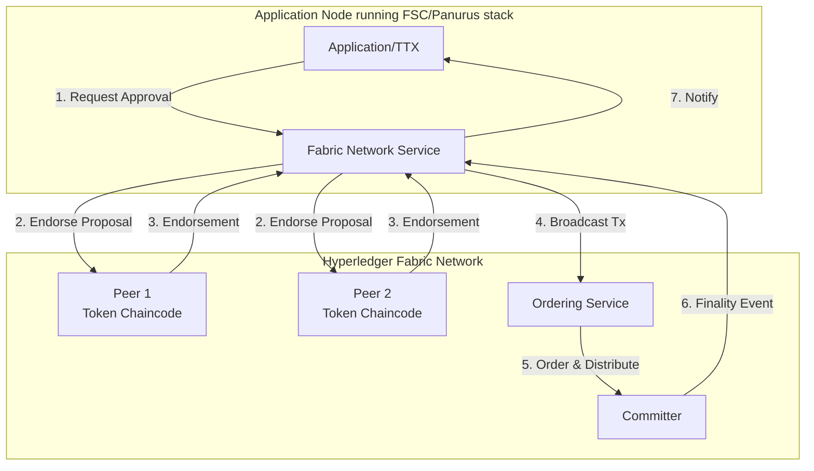
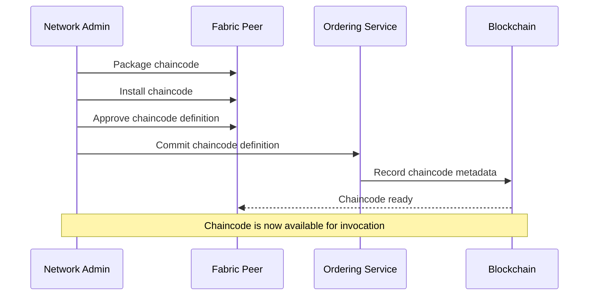
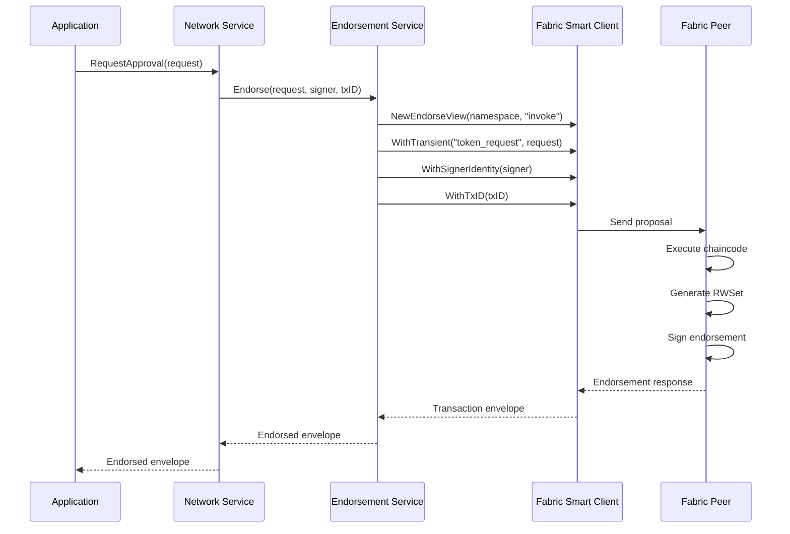
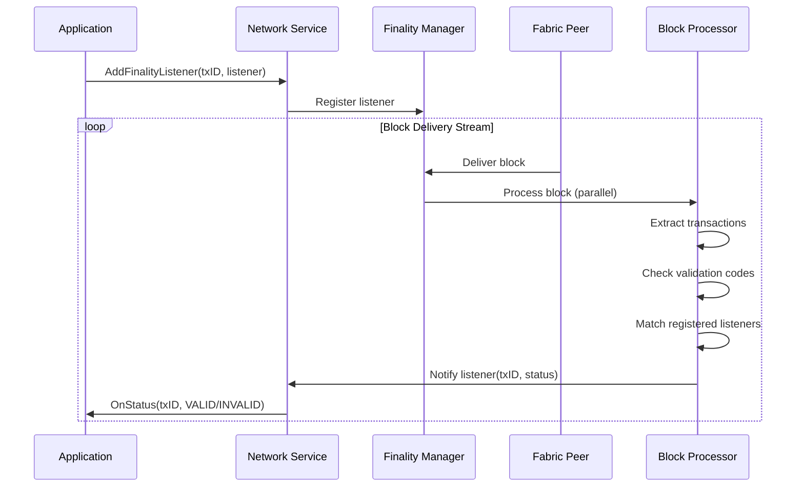
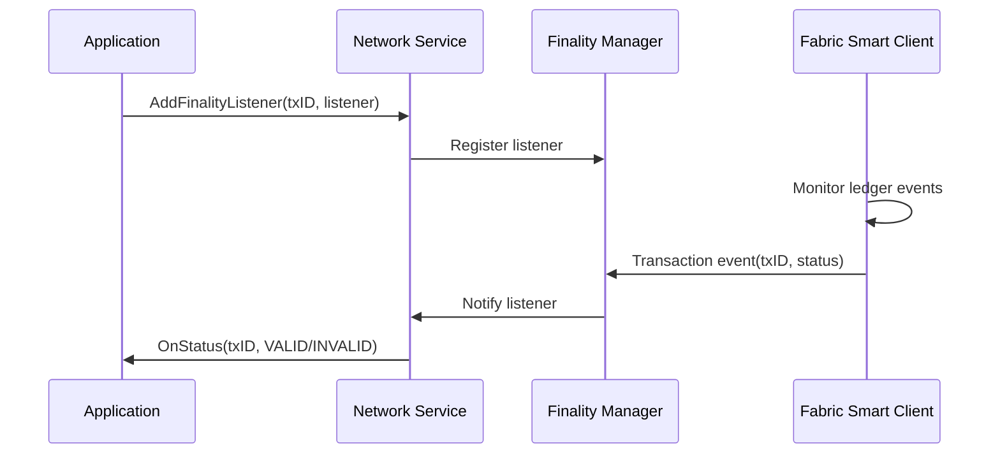
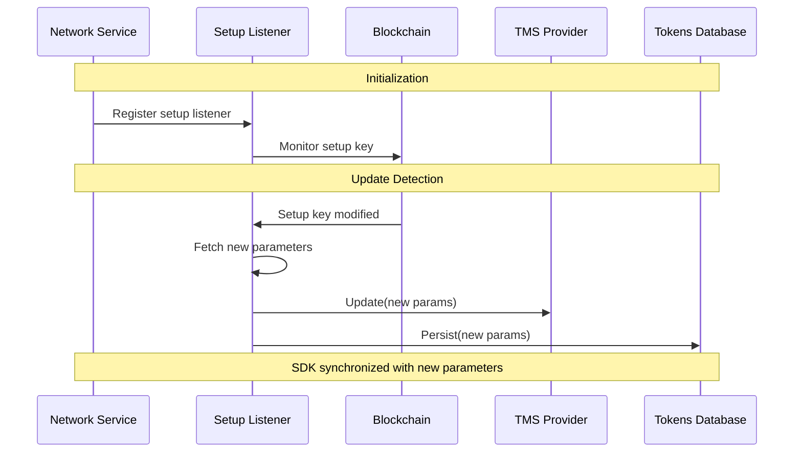
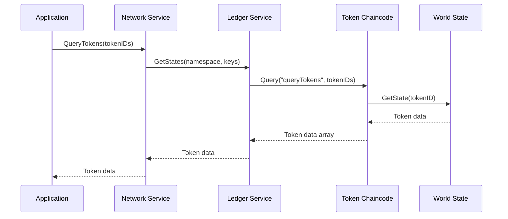
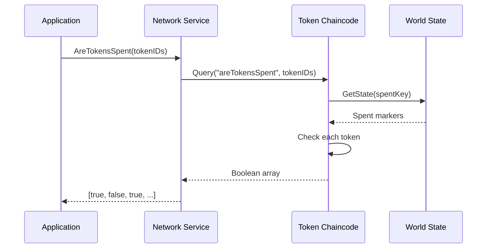

# Network Service - Fabric Implementation

The Fabric network implementation ([`fabric.Network`](../../token/services/network/fabric/network.go)) provides integration with Hyperledger Fabric networks using the traditional chaincode-based endorsement model. It leverages the Fabric Smart Client (FSC) to interact with the underlying Hyperledger Fabric network.

## Architecture Overview

The Fabric implementation uses a **Token Chaincode** deployed on Fabric peers to handle token operations. 
This chaincode validates token requests, manages token state, and enforces business logic.



## Token Chaincode

The Token Chaincode ([`tcc.TokenChaincode`](../../token/services/network/fabric/tcc/tcc.go)) is a Fabric chaincode that runs on peers and handles all token-related operations.

### Chaincode Functions

The chaincode exposes the following functions:

| Function | Purpose | Parameters               | Returns |
|----------|---------|--------------------------|---------|
| `invoke` | Process token requests (issue, transfer, redeem) | Token request (transient) | Transaction envelope |
| `queryPublicParams` | Retrieve public parameters | <none>                   | Public parameters bytes |
| `queryTokens` | Query token state | Token IDs                | Token data |
| `areTokensSpent` | Check if tokens are spent | Token IDs, metadata      | Boolean array |
| `queryStates` | Query arbitrary state keys | State keys               | State values |

### Chaincode Deployment

The Token Chaincode must be deployed to the Fabric network before Panurus can operate:



**Deployment Steps:**
1. **Package**: Create chaincode package with Token Chaincode implementation
2. **Install**: Install package on all endorsing peers
3. **Approve**: Each organization approves the chaincode definition
4. **Commit**: Commit the chaincode definition to the channel
5. **Initialize**: Initialize the chaincode so it writes the selected public parameters to the ledger setup key

### Chaincode Initialization

At initialization time, the chaincode loads public parameters and persists them to the setup key on the ledger. The implementation in [`tcc.TokenChaincode.Init()`](../../token/services/network/fabric/tcc/tcc.go) calls [`tcc.TokenChaincode.Params()`](../../token/services/network/fabric/tcc/tcc.go), which resolves the parameters using the following precedence:

1. **File-based override**: if the `PUBLIC_PARAMS_FILE_PATH` environment variable is set, [`tcc.TokenChaincode.ReadParamsFromFile()`](../../token/services/network/fabric/tcc/tcc.go) reads the raw public-parameter bytes from that file and feeds them back as a base64 string.
2. **Built-in parameters**: if no file is provided, [`tcc.Params`](../../token/services/network/fabric/tcc/params.go) is used. In the source tree this variable is empty by default, but packaging tools replace [`tcc/params.go`](../../token/services/network/fabric/tcc/params.go) with generated content that embeds a base64-encoded blob of the public parameters into the chaincode package itself.
3. **Failure**: if neither source is available, initialization fails.

This means the token chaincode supports both models:
- **Burned into the chaincode package**: the usual deployment path, where packaging injects the public parameters into [`tcc.Params`](../../token/services/network/fabric/tcc/params.go)
- **Loaded from file at runtime**: an override path controlled by `PUBLIC_PARAMS_FILE_PATH`

`tokengen` can also generate the token-chaincode package with the public parameters already embedded, by generating a replacement for [`tcc/params.go`](../../token/services/network/fabric/tcc/params.go) from the template in [`cc.DefaultParams`](../../cmd/tokengen/cobra/pp/cc/params.go) as part of [`cc.GeneratePackage()`](../../cmd/tokengen/cobra/pp/cc/cc.go).

```go
// Simplified initialization flow
func (cc *TokenChaincode) Init(stub shim.ChaincodeStubInterface) *pb.Response {
    // Resolve public parameters from file override or built-in Params
    ppRaw, err := cc.Params(Params)

    // Write the selected parameters to the ledger setup key
    w := translator.New(stub.GetTxID(), ...)
    w.Write(context.Background(), &SetupAction{SetupParameters: ppRaw})

    return shim.Success(nil)
}
```

## Endorsement Service

The Fabric implementation supports chaincode-based endorsement through the [`ChaincodeEndorsementService`](../../token/services/network/fabric/endorsement/chaincode.go).

### Endorsement Process



### Endorsement Policies

The chaincode endorsement follows Fabric's standard endorsement policies:

- **Signature Policy**: Requires signatures from specific organizations
- **Channel Policy**: Uses channel-level endorsement configuration
- **Chaincode Policy**: Defined during chaincode deployment

Example policy: `"OR('Org1MSP.peer', 'Org2MSP.peer')"` - requires endorsement from either Org1 or Org2.

### FSC Endorsement

As an alternative to chaincode-based endorsement, FSC nodes equipped with a proper
endorsement key can endorse the token chaincode themselves (see
`services.network.fabric.fsc_endorsement` in [Configuration](../configuration.md)).
The set of endorsers to contact is selected by `fsc_endorsement.policy.type`:

- `1outn` — contact one random configured endorser.
- `all` (default) — contact all configured endorsers.
- `namespace` — fetch the namespace's real endorsement policy via Fabric service
  discovery (`Channel.Chaincode(namespace).Discover()`) and contact a random subset of
  the configured endorsers that satisfies it. Discovery already returns the required
  MSPs; if none of the configured endorsers can cover them, endorsement fails with an
  error rather than falling back to a weaker policy. See
  [FabricX FSC Endorsement Service](network-fabricx.md#fsc-endorsement-service) for
  the equivalent (query-service-based) mechanism on FabricX.

### Public Parameters Setup/Update via FSC

Besides endorsing token requests, the same FSC endorsement machinery can be used to
submit new or updated public parameters (PP) for a namespace, as an alternative to
setting them through the chaincode `Init` lifecycle callback. A second
initiator/responder pair handles this:

- `SetupPublicParamsView` (initiator) builds an endorsement proposal carrying the raw
  PP bytes and submits it for endorsement, exactly like `RequestApprovalView` does for
  token requests.
- `SetupPublicParamsResponderView` (responder) receives the proposal, validates it, and
  writes the PP into the RWSet via the existing `translator.SetupAction` mechanism —
  the same setup key/hash that the chaincode `Init` path writes.

The two initiator/responder pairs are distinguished by chaincode function name and
transient key: the token-request flow uses the `invoke` function, while the PP flow
uses a dedicated `setup` function and carries the raw parameters under a dedicated
`public_params` transient key (in addition to the `tmsID` key used by both).

Both responders share a common `receive` step that only checks that the proposal's
`tmsID` transient carries a non-empty network, channel, and namespace — it does not
look up the TMS itself. Each responder looks up the TMS for that `tmsID` on its own,
at validation time, and decides for itself whether an absent TMS is a problem:

- The token-request responder (`invoke`) requires an existing TMS; if none is found,
  validation fails.
- The PP setup responder (`setup`) tolerates a missing TMS, since the namespace may be
  going through its first-time initialization. Any other lookup error (i.e. anything
  other than "TMS not found") still fails validation.

Endorsing the proposal (common to both responders) needs the local endorser identity,
resolved from `fsc_endorsement.id` in the namespace's configuration. This is resolved
directly from configuration rather than through a fully-built TMS, so it also works
during first-time PP setup, before any TMS exists for the namespace.

The responder enforces the following before writing:

1. If a TMS is found for the namespace, its ID must match the `tmsID` carried by the
   proposal.
2. The raw PP must be deserializable (`PublicParametersFromBytes`) and pass
   `PublicParameters.Validate()`.
3. If a TMS with existing public parameters is already present for the namespace, the
   submitted PP's driver name and version must match the existing ones. This check is
   skipped for first-time setup, when no PP exists yet.

There is no separate "init" vs. "update" API: the write is an unconditional overwrite
of the setup key, mirroring the semantics of the chaincode `Init` path. Endorser
selection reuses the same `fsc_endorsement.policy.type` mechanism described above
(`1outn`/`all`/`namespace`) — there is no separate policy configuration for PP setup.

As with token requests, the responder does not refresh the local TMS directly after
writing; the existing ledger setup-key listener (see
[Public Parameters Management](#public-parameters-management)) detects the committed
write and updates the TMS.

#### Reachability

`SetupPublicParamsView` is reachable from application code through the same layering
as `RequestApproval`, but keyed by `TMSID` rather than `*token.ManagementService` — a
namespace has no TMS yet before its first PP setup:

```
network.Network.SetupPublicParams(tmsID, ppRaw, signer, txID)
  -> driver.Network.SetupPublicParams
    -> fabric.Network.SetupPublicParams
      -> endorsement.Service.SetupPublicParams
        -> fsc.EndorsementService.SetupPublicParams
          -> NewSetupPublicParamsView
```

Chaincode-based endorsement (`ChaincodeEndorsementService`) does not support this
call and returns an error — for that endorsement mode, PP setup/update remains
exclusively through the chaincode `Init` lifecycle callback described above.

## Finality Management

The Fabric implementation supports two modes for monitoring transaction finality:

### Delivery Mode

Uses a block delivery stream from the peer for real-time finality tracking:



**Features:**
- Parallel block processing for high throughput
- Configurable parallelism levels
- LRU cache for recent transactions
- Automatic retry on connection failures

### Notification Mode

Uses asynchronous event notifications from the FSC layer:



## Public Parameters Management

The Fabric implementation monitors the ledger for public parameters updates:



### Setup Key Monitoring

The setup listener watches for changes to a specific ledger key that stores public parameters. This mechanism is based on delivery as the finality path, because setup-key updates are detected from committed ledger events delivered by the peer:

1. **Key Format**: Derived from namespace and setup identifier
2. **Update Trigger**: Any transaction that writes to the setup key
3. **Validation**: Parameters are validated before being applied
4. **Persistence**: New parameters are stored in the local database

The same delivery-based mechanism is reused by the [lookup service](../../token/services/network/fabric/lookup/deliveryllm.go) to detect transfer action metadata writes: it derives the transfer action metadata key prefix from [`KeyTranslator.TransferActionMetadataKeyPrefix`](../../token/services/network/common/rws/translator/rwset.go) and prefix-matches rwset writes against it, without needing to know each write's specific subkey ahead of time.

## State Queries

The Fabric implementation provides efficient state querying through the chaincode:

### Token Queries



### Spent Status Checks



## Configuration

### Basic Configuration

```yaml
token:
  enabled: true
  tms:
    my-fabric-tms:
      network: fabric-network-name  # Matches fsc.networks configuration
      channel: my-channel
      namespace: my-chaincode-id    # Token chaincode name
```

### Finality Configuration

```yaml
token:
  finality:
    type: delivery  # "delivery" or "notification"
    committer:
      maxRetries: 3
      retryWaitDuration: 5s
    delivery:
      mapperParallelism: 10        # Parallel transaction mappers
      blockProcessParallelism: 10  # Parallel block processors
      lruSize: 30                  # Cache size for recent transactions
      listenerTimeout: 10s         # Timeout for listener notifications
```

### Endorsement Configuration

```yaml
# Chaincode-based endorsement (default)
# No additional configuration needed - uses Fabric's endorsement policies
```

## Implementation Details

### Key Components

1. **Network** ([`fabric.Network`](../../token/services/network/fabric/network.go))
   - Main network service implementation
   - Coordinates endorsement, ordering, and finality

2. **Ledger** ([`fabric.ledger`](../../token/services/network/fabric/network.go))
   - Provides state query capabilities
   - Wraps Fabric Smart Client ledger interface

3. **Endorsement Service** ([`endorsement.ChaincodeEndorsementService`](../../token/services/network/fabric/endorsement/chaincode.go))
   - Handles chaincode invocation for endorsement
   - Manages transient data and transaction IDs

4. **Finality Manager** ([`finality.ListenerManager`](../../token/services/network/fabric/finality/))
   - Tracks transaction finality
   - Notifies registered listeners

5. **Token Chaincode** ([`tcc.TokenChaincode`](../../token/services/network/fabric/tcc/tcc.go))
   - Validates token requests
   - Manages token state on-chain

### Transaction ID Calculation

```go
// Fabric uses SHA256(nonce || creator) for transaction IDs
func (n *Network) ComputeTxID(id *driver.TxID) string {
    temp := &fabric.TxID{
        Nonce:   id.Nonce,
        Creator: id.Creator,
    }
    return n.n.TransactionManager().ComputeTxID(temp)
}
```

## See Also

- [Network Service Overview](./network.md) - Generic network service concepts
- [FabricX Implementation](./network-fabricx.md) - FSC-based endorsement
- [Token Chaincode](../../token/services/network/fabric/tcc/) - Chaincode implementation
- [TTX Service](./ttx.md) - Token transaction orchestration
- [Public Parameters](../public_parameters.md) - Cryptographic setup